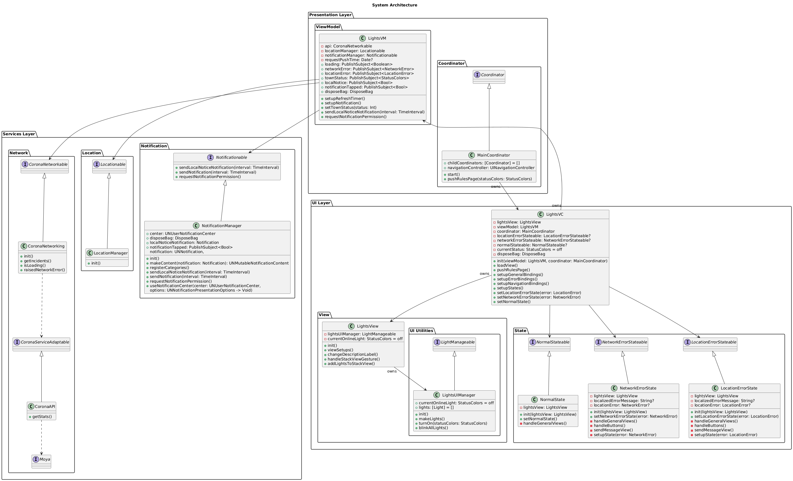

# Germany Corona Light 🇩🇪🚦🦠

  


## Overview
Germany Corona Light is a meticulously designed iOS app that elegantly displays the current status of COVID-19 restrictions and alerts in Germany using a traffic light metaphor. Built with cutting-edge technologies and clean architecture, it serves as a perfect example of a scalable, user-focused application.

## Features 🚀
- **Real-Time Location-Based Status**: Displays COVID-19 rules and restrictions based on your location.
- **Localization**: Fully localized for English 🇬🇧 and German 🇩🇪.
- **Interactive UI**: Intuitive design with smooth animations and visual feedback.
- **Extensibility**: Easily adaptable for other states in Germany.

## System Architecture
Designed with scalability and maintainability in mind, the architecture employs **MVVM+C** with RxSwift and incorporates multiple design patterns for an optimal codebase.



# Installation ✅

1. [Download](https://github.com/mamadfrhi/Germany-Corona-Light/archive/main.zip) or Clone the project:
```bash
$ git clone https://github.com/mamadfrhi/Germany-Corona-Light.git
```

2. Install dependencies using CocoaPods:
```bash
$ cd .../project_directory/Corona_Light
$ pod update
```

3. Open `Corona_Light.xcworkspace` and run the app:
```bash
Cmd + R
```

# Testing 🔁

### Simulate Location
1. Select the iOS simulator.
2. Navigate to `Feature > Location > Custom Location...`.
3. Enter the following:
    - Lat: `49.763138`
    - Long: `10.697828`

### Test Localization
Switch to German in the simulator:
```bash
Settings > General > Language & Region > Deutsch
```

# Code Style 🛠
This project demonstrates expertise in clean architecture and SOLID principles, emphasizing scalability and maintainability.

## Design Patterns ⚙️
- State
- Template
- Coordinator
- Singleton
- Adapter
- Delegate
- Decorator
- Facade

## Principles 💎
- Object-Oriented Programming (OOP)
- Protocol-Oriented Programming (POP)
- SOLID Principles
- Clean Code

## Frameworks Used ➕

### Native 📱
- **UIKit**
- **CoreLocation**
- **NotificationCenter**

### Pods 🧑‍💻
- **Networking**:
  - [SwiftyJSON](https://github.com/SwiftyJSON/SwiftyJSON)
  - [Moya](https://github.com/Moya/Moya)
- **UI**:
  - [JGProgressHUD](https://github.com/JonasGessner/JGProgressHUD)
  - [SwiftMessages](https://github.com/SwiftKickMobile/SwiftMessages)
  - [SnapKit](https://github.com/SnapKit/SnapKit)
- **Reactive Programming**:
  - [RxSwift](https://github.com/ReactiveX/RxSwift)
  - [RxCocoa](https://github.com/ReactiveX/RxSwift/tree/main/RxCocoa)

# Main Classes Diagrams

The core logic of the application is illustrated below:


# Screenshots 📱

### English 🇬🇧
<p float="left">


</p>

### German 🇩🇪
<p float="left">


</p>

# Video 🎥

Watch the app in action:
[](https://user-images.githubusercontent.com/28094207/166139678-5fcd311a-adcc-40da-85b1-4b1c72e0c05c.mp4)

# API Documents 📄

[Click here to see API docs](https://npgeo-corona-npgeo-de.hub.arcgis.com/datasets/917fc37a709542548cc3be077a786c17_0)

# Extensibility 🔁🇩🇪

To use this app for other German states:

1. Open `.../Resources/Info.plist`.
2. Locate `stateName = Bayern;`.
3. Replace `Bayern` with the desired state's name (in German).

Example:
- ❌ English: `Bavaria`
- ✅ German: `Bayern`

# Contribution 💖
Contributions are welcome! Please feel free to discuss ideas or submit pull requests.

### Resources
You can download the app design in Adobe XD [here](https://github.com/mamadfrhi/Germany-Corona-Light/raw/main/Corona%20Light/Resources/Corona%20Status%20Design.xd).
